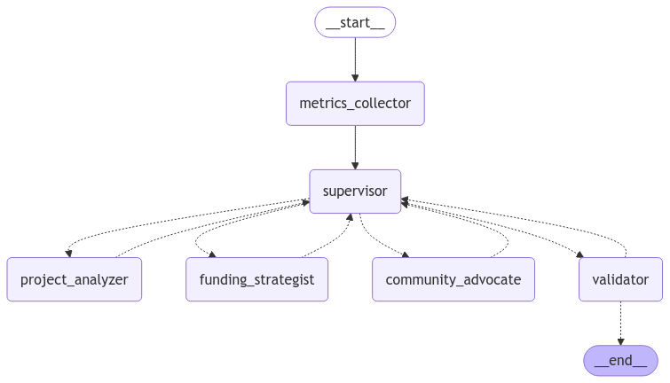

# Deepfunding-Agent
Build AI Agent to better funding public goods, specifically for [deepfunding.org](https://deepfunding.org)

## Usage
1. Install [Poetry](https://github.com/python-poetry/poetry) for Python dependency management.
2. Prepare .env
```bash
poetry install
cp .env.example .env
```
Huggingface part1 [mini-contest.ipynb](./mini-contest.ipynb)

## How It Works


1. Metrics Collector
- Gathers repository metrics from [OSO](https://docs.opensource.observer/)
- Analyzes README content
- Online search for additional information
- Generate a metrics report 
2. Multi Analyzer Agents
- Each agent reads the metrics report and provides structured analysis including weights, reasoning, and confidence.
- Project Analyzer: Evaluates technical aspects and project fundamentals
- Funding Strategist: Focuses on funding history and resource allocation
- Community Advocate: Analyzes community engagement and ecosystem impact
3. Validator: Check each agent's analysis is comprehensive and well-justified. If not, send back to analyzer agent for revision.
4. Consensus: Combine results from all agents, calculate final weights

## Development

### Add/Change Agents
https://langchain-ai.github.io/langgraph/tutorials/introduction/
`workflow.add_node` in [deepfunding.py](./deepfunding.py)

### VsCode
Get the poetry environment path and paste it to your VsCode Python: Select Interpreter
```bash
poetry env info --path | pbcopy
```

### Poetry
Add new dependencies
```bash
poetry add <package>
```
